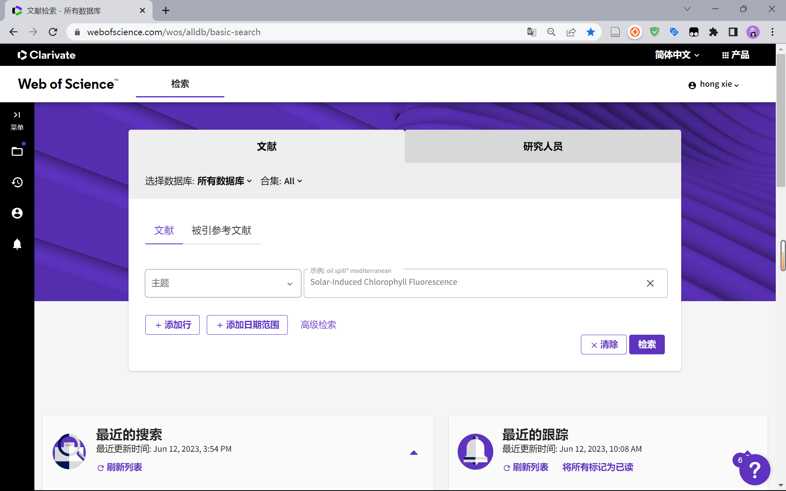
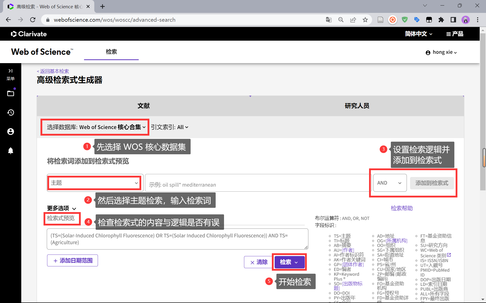
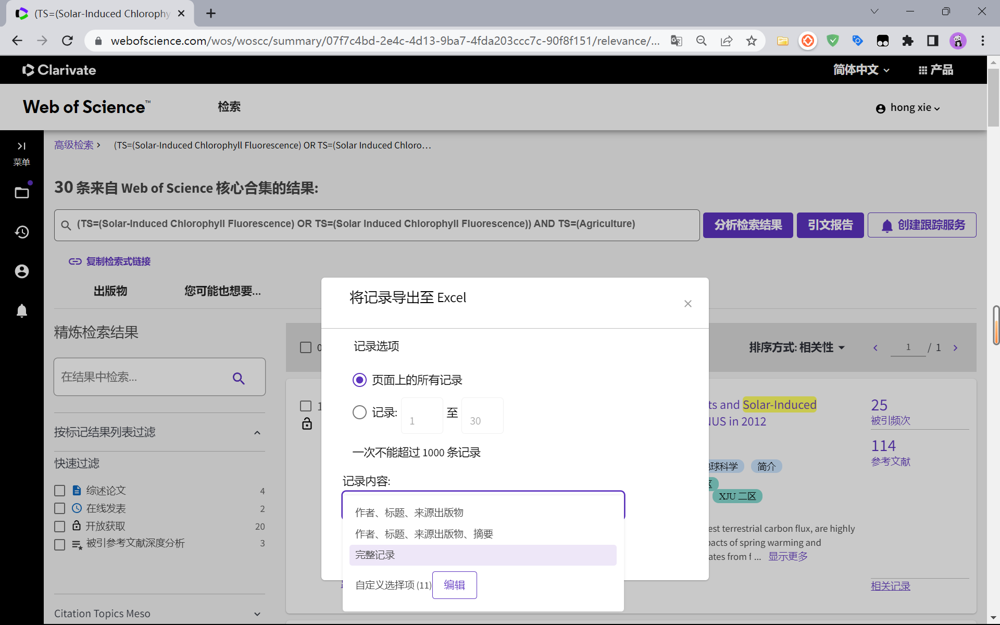
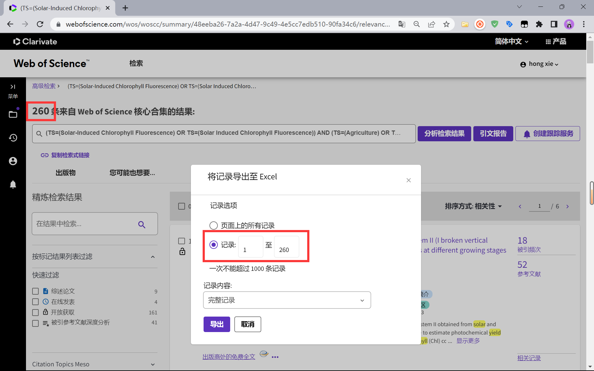

# 开发记录（一）WOS 论文检索


## 1 Web of Science (WOS) 基本介绍

Web of Science (https://www.webofscience.com/wos) 是一个大型综合性、多学科、核心期刊引文索引数据库，包括科学引文索引、社会科学引文索引、艺术与人文科学引文索引等，可以用来检索论文、分析领域发展趋势、查询期刊影响因子等。



<center>图 1 WOS 基本检索界面</center>


## 2 检索论文

### 2.1 高级检索步骤

1、首先，我们要选择 WOS 核心合集，在这个合集中，才会记载 作者关键词和 Keywords Plus 等论文的核心内容信息；

2、然后，根据需要逐一将检索词以预设逻辑添加到检索式中；

3、随后，检查自动生成的检索式的逻辑，以防括号导致的检索式逻辑问题；

4、最后，在检查检索式内容和逻辑均无误后，即可开始检索。

### 2.2 检索词与检索式

主题：在检索主题时，会检索文献的标题、摘要、作者关键词和 Keywords Plus（WOS赋予文章的关键词）

下面是示例使用的三个检索词，按照 OR，AND 的逻辑进行检索。在检索时，不区分大小写。

```
Solar-Induced Chlorophyll Fluorescence

Solar Induced Chlorophyll Fluorescence

Agriculture
```

得到检索式如下：

```
(TS=(Solar-Induced Chlorophyll Fluorescence) OR TS=(Solar Induced Chlorophyll Fluorescence)) AND TS=(Agriculture)
```



<center>图 2 WOS 高级检索示例</center>

### 2.3 导出检索结果

在导出时，设置记录内容为：完整记录，则会将检索到的论文全部相关信息导出到 Excel 表格中。



<center>图 3 导出检索结果的完整记录</center>


## 3 再次检索

由于检索结果的过少，并且我们想检索 SIF 与农业相关的文献，所以我们将检索式调整成如下形式：

```
(TS=(Solar-Induced Chlorophyll Fluorescence) OR TS=(Solar Induced Chlorophyll Fluorescence)) AND (TS=(Agriculture) OR TS=(Yield) OR TS=(Crop))
```

在扩大检索范围后，文献的数量从 30 篇增加到了 260 篇，我们将结果重新导出即可。需要注意的是，想要导出所有文献，必须选择如下内容。



<center>图 4 重新检索的结果</center>
