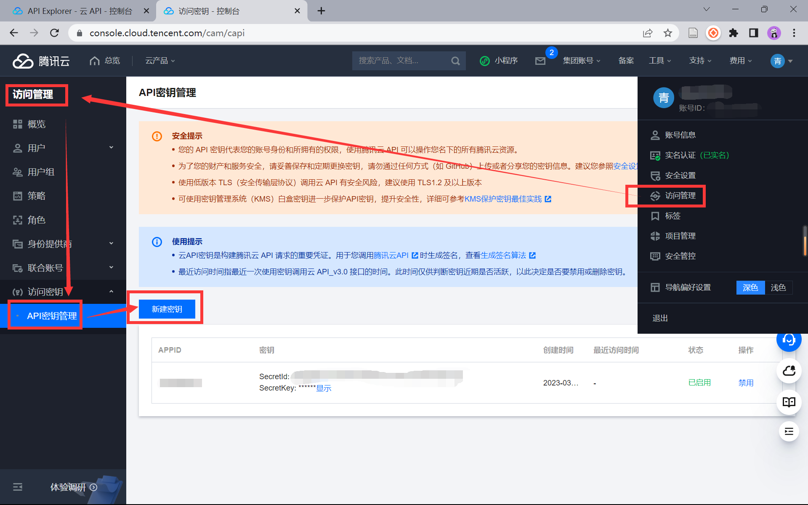
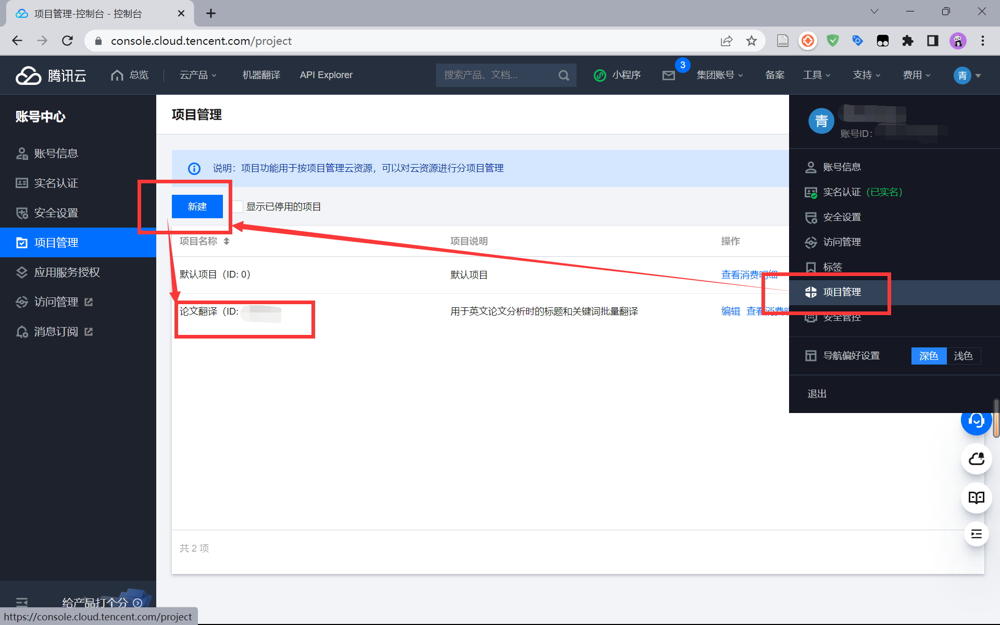

# 开发记录（四）机器翻译


## 1 模块介绍

本模块借助了 [腾讯云机器翻译 API](https://cloud.tencent.com/document/api/551/15619) 的批量文本翻译功能，实现对关键词列表的批量翻译，并且将翻译模块封装成单个模块，以便主模块更灵活地调用批量翻译功能。本模块封装在 `tencent_translate.py` 文件中。


## 2 API 相关配置

### 2.1 新建密钥

首先需要在腾讯云控制台中建立密钥，密钥包括 SecretId，SecretKey 两个核心内容



### 2.2 新建项目

在创建密钥后，还需要新建项目使用项目 ID 才能正式实现腾讯云机器翻译 API 的调用。



### 2.3 导入模块

导入腾讯云机器翻译 API 相关模块

```python
from tencentcloud.common import credential
from tencentcloud.common.profile.client_profile import ClientProfile
from tencentcloud.common.profile.http_profile import HttpProfile
from tencentcloud.common.exception.tencent_cloud_sdk_exception import TencentCloudSDKException
from tencentcloud.tmt.v20180321 import tmt_client, models
```

### 2.4 添加密钥

将创建好的腾讯云 API 密钥对和项目 ID 添加到程序中，才能正常的使用 API 的翻译功能。

```python
secretId = "……"
secretKey = "……"
projectId = ……
```

### 2.5 设置源语言和目标语言

程序中自动识别源语言，将所有内容都翻译为中文。

```
source = "auto"
target = "zh"
```


## 3 读取数据

将读取到的数据表列名转换为以列表的形式，以便与 API 进行翻译交互。

```python
def read_column(source_file, source_column):
    df = pd.read_excel(source_file)
    words = df[source_column]
    words_list = words.tolist() # 转换为列表
    return words_list
```


## 4 翻译交互


## 5 存储翻译结果

在实现与 API 的交互并得到返回的翻译数据后，将其与源数据进行合并，并导出成新的 excel 表格进行存储。

```python
def write_results(source_file, source_column, target_file):
    source_df = pd.read_excel(source_file) # 读取原文件为一个DataFrame
    target_text_list = translate_words(source_file, source_column) # 调用翻译函数，返回一个list
    target_column = source_column + "_Translation" # 翻译后文本存放的列名
    target_df = pd.DataFrame(target_text_list, columns=[target_column]) # 将list转换为一个DataFrame，并指定列名
    new_df = source_df.join(target_df) # 将两个DataFrame按照索引合并为一个新的DataFrame
    new_df.to_excel(target_file, index=False) # 将新的DataFrame直接写入到文件中，指定index参数
```

