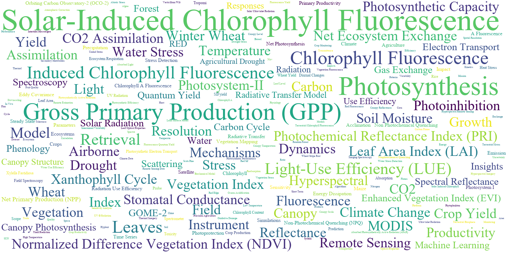
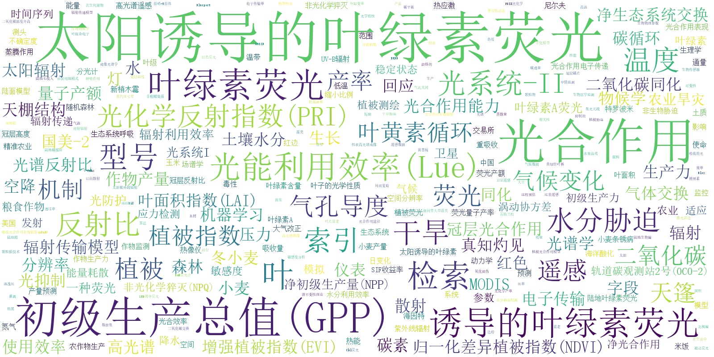

# 开发记录（五）关键词词云可视化


## 1 模块介绍

在对关键词进行 合并、首字母大写、词频统计、翻译等一系列处理后，使用词云包与 `pyecharts` 包来实现关键词词云图的显示。本模块封装在 `words_cloud.py` 文件中。


## 2 词云图绘制

### 2.1 创建和保存词云图像

```python
def create_wordcloud(word_freq, font_path, output_file):
    wc = WordCloud(
        background_color = 'white', 
        prefer_horizontal = 1, 
        min_font_size = 2,
        max_font_size = 32,
        font_path = f'../data/fonts/{font_path}', # 使用 f-string 格式化字符串
        scale = 4,
        max_words = 300,
        random_state = 42, # 设置随机状态为一个固定的整数
        colormap = 'viridis' # 指定颜色映射
    ).generate_from_frequencies(word_freq)
    plt.figure(figsize=(12,12), dpi=300)
    plt.imshow(wc, interpolation='bilinear')
    plt.axis("off")
    plt.show()
    wc.to_file(f'../data/output/{output_file}')
```


### 2.2 绘制关键词词云

在调用时，默认绘制英文词云，中文词云需要另行设置 `lang=zh`。

```python
def keywordCloud(inputFile, lang='en'):
    # 读取 xlsx 文件中的数据
    df = pd.read_excel(inputFile)
    # 将数据转换成字典，键为关键词，值为频数
    word_freq = dict(zip(
        df['Keyword' if lang == 'en' else 'Keyword_Translation'],
        df['Count']
    ))
    # 调用函数，生成英文/中文的词云图像
    wc = create_wordcloud(
        word_freq,
        f'../data/fonts/TIMES.ttf' if lang == 'en' else f'../data/fonts/simsun.ttc',
        f'wos_wordcloud_{lang}.png'
    )
```


## 3 主文件调用

在主文件 `wos_essay.ipynb` 文件中，导入模块，调用词云绘制函数

```
from words_cloud import keywordCloud
inputFile3 = outputFile2
keywordCloud(outputFile3)
keywordCloud(outputFile3, lang='zh')
```



<center>图 1 英文词云</center>



<center>图 2 中文词云</center>
