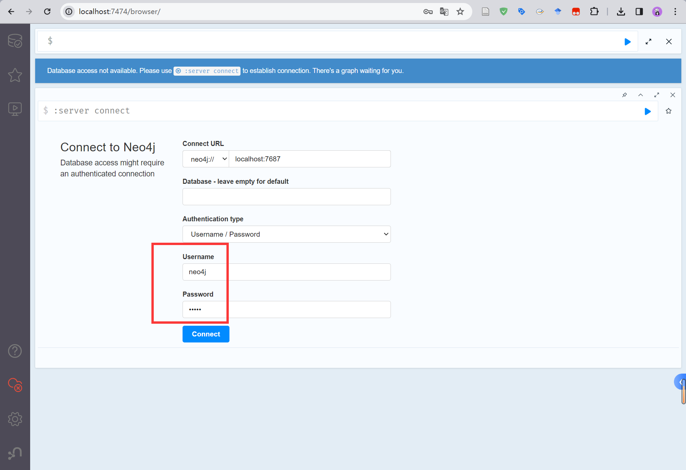

# 开发记录（六）结合知识图谱的论文批量分析


## Neo4j 环境配置

### 当前环境

- `Windows11`，`jdk-17-windows`，`neo4j-community-5.18.1-windows`

### 官方文档

- Neo4j官方安装教程：https://neo4j.com/docs/operations-manual/current/installation/windows/
- Neo4j官方简易使用教程：https://neo4j.com/download-thanks/?edition=community
- Neo4j官方Python联合使用教程：https://neo4j.com/docs/python-manual/current/

### 启动数据库

每次使用，都要使用 cmd 输入命令进行启动。

```
neo4j console
```

第一次登录时，使用默认密码，都是 neo4j。登录后会强制重新设置密码，务必记住密码！！！




## 工作流程

1. 使用 Zotero 阅读论文，并给论文打上标签
2. 从 Zotero 中批量导出论文信息，保存为 csv 格式，并将其放置在 `src/data/input/` 目录中
3. 打开 `src/build_graph.py` 文件，在最低部修改待分析的文件名称，然后【**先启动Neo4j数据库**】再运行代码
4. 如果图谱效果不好，可以在 `src/data/input/rs_general_knowledge/` 目录中，对几种属性进行填充


备份neo4j数据库，在cmd中输入：

```
neo4j-admin database dump neo4j --to-path=E:\\researchDemo\\essay-auto-analysis\\src 
```


## 相关参考

- [CSDN - Neo4j安装与配置以及JDK安装与配置教程（超详细）](https://blog.csdn.net/2301_77554343/article/details/135692019)
- [GitHub - liuhuanyong/QASystemOnMedicalKG](https://github.com/liuhuanyong/QASystemOnMedicalKG)
- [GitHub - keyucui/paper_basic_analysis](https://github.com/keyucui/paper_basic_analysis)
- [GitHub - changyiru-code/Vulnerability-Knowledge-Graph](https://github.com/changyiru-code/Vulnerability-Knowledge-Graph)
- [CSDN - 【Neo4j可视化工具1】官方工具 Neo4j Bloom 的官网个人免费版使用方式](https://blog.csdn.net/m0_65797987/article/details/135838264)
