# 基于 WOS 论文信息数据构建目标研究领域知识网络和知识图谱：以 SIF 领域研究为例


## 第一章 研究介绍

&emsp;&emsp;本节介绍本研究动机和核心思路，以及涉及到的相关概念，如 WOS、SIF、论文分析工具、知识图谱等。

### 1.1 研究动机

&emsp;&emsp;首先，在进行 SIF 领域的研究时，需要阅读大量的相关论文摘要，但是由于时间和精力的限制，无法逐一阅读。因此，希望开发一个能够自动化提取论文元数据（如研究方向、研究方法、研究区域、研究应用、相关期刊、引领研究的国家等）的工具，以便快速了解论文的主要内容和特点。

&emsp;&emsp;其次，受到 Connected Papers 和 CiteSpace 等论文网络分析和可视化方法的启发，想要结合自身需求设计出一个能够对批量论文信息进行网络分析和可视化的工具，以便发现论文之间的联系和规律，以及目标领域的知识结构和发展趋势。

&emsp;&emsp;最后，想要将自己接触到的业务开发与科研工作相结合，将自身做学融汇贯通，形成属于自己的一个完整的系统。

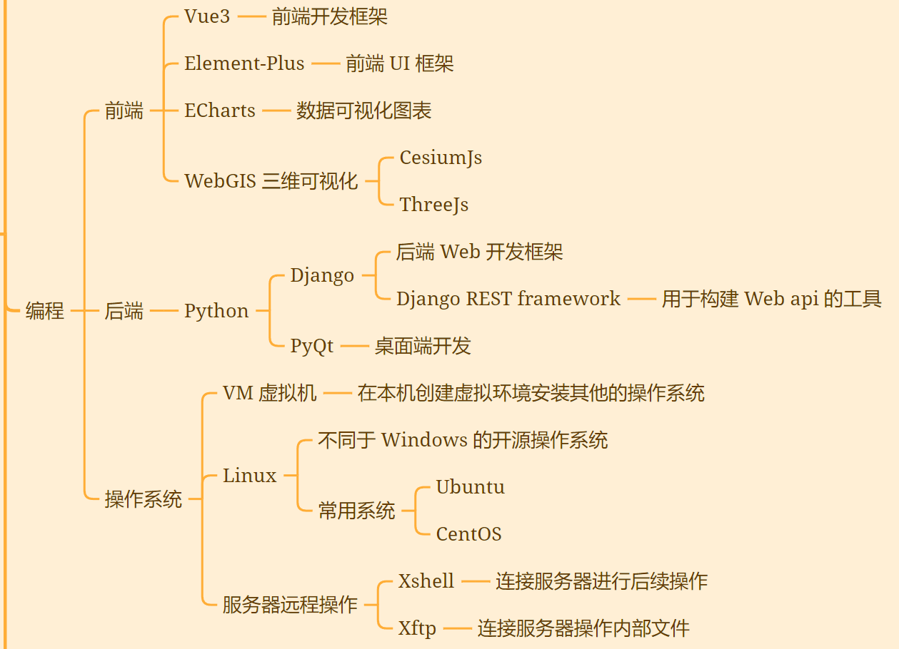

<center>图 1-1 当前学习技能</center>

### 1.2 核心思路

&emsp;&emsp;本研究利用 Python 工具对 Web of Science 检索到的某一目标领域（以 SIF 太阳诱导的叶绿素荧光遥感在农业上的运用为例）的相关论文信息数据进行分析，构建该领域的知识网络和知识图谱，实现对该领域核心内容的快速理解和掌握，为科研工作提供支持。本研究涉及到自然语言处理、图论等相关领域的方法和技术，具有一定的创新性和实用性。

### 1.3 相关概念

#### 1.3.1 Web of Science (WOS)

&emsp;&emsp;Web of Science 是一个大型综合性、多学科、核心期刊引文索引数据库，包括科学引文索引、社会科学引文索引、艺术与人文科学引文索引等，可以用来检索论文、分析领域发展趋势、查询期刊影响因子等。

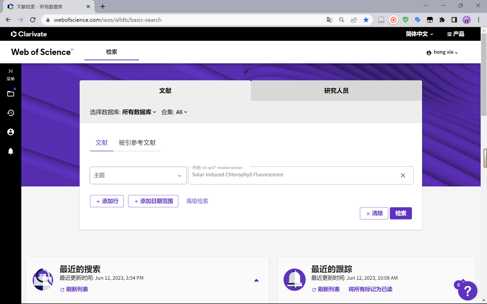

<center>图 1-2 WOS 基本检索界面</center>

#### 1.3.2 SIF

&emsp;&emsp;Solar induced chlorophyll fluorescence(SIF) 是指植物叶片在光合作用过程中发出的一种微弱的荧光，可以反映植物的光合活性和生态系统的碳循环状态。关键要素：太阳、叶片、反射、荧光、光合作用、热量、透光。

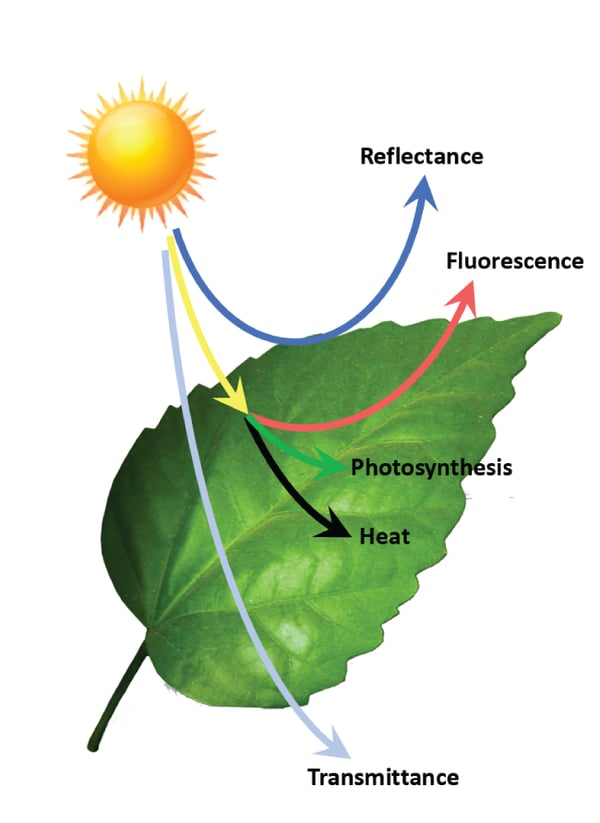

<center>图 1-3 植物光合作用示意图</center>

#### 1.3.3 论文分析工具

&emsp;&emsp;Connected Papers：是一个在线工具，可以根据一篇论文找到相关的论文，并以图形的方式展示它们之间的联系，帮助用户探索某个领域的知识网络，发现研究热点和前沿。

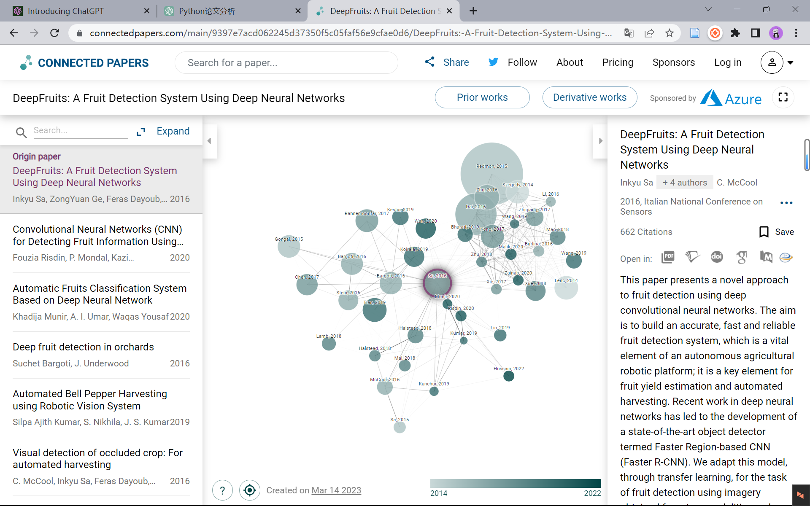

<center>图 1-4 Connected Papers 文献检索界面</center>

&emsp;&emsp;CiteSpace：是一个基于Java的可视化分析软件，可以对Web of Science等数据库中的文献数据进行引文网络分析，揭示出学科领域的知识结构和演化过程。

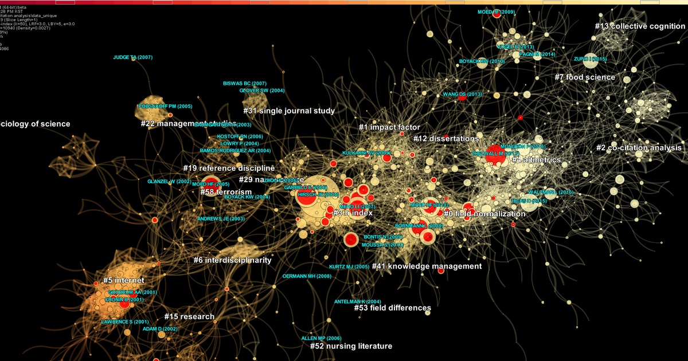

<center>图 1-5 CiteSpace 论文分析示例图</center>

#### 1.3.4 知识图谱

&emsp;&emsp;知识图谱（Knowledge Graph）是一种用结构化的形式描述客观世界中概念、实体及其之间关系的语义网络，可以将互联网的信息表达成更接近人类认知世界的形式，提供了一种更好地组织、管理和理解互联网海量信息的能力。知识图谱的基本组成单位是“实体—关系—实体”三元组，以及实体及其相关属性—值对，实体间通过关系相互联结，构成网状的知识结构。

&emsp;&emsp;知识图谱可以分为通用知识图谱和特定领域知识图谱，通用知识图谱面向的是通用领域，强调知识的广度，形态通常为结构化的百科知识；特定领域知识图谱则面向某一特定领域，强调知识的深度，通常需要基于该行业的数据库进行构建。

&emsp;&emsp;知识图谱涉及的技术主要包括知识抽取、知识表示、知识融合、知识推理等，这些技术可以帮助从不同来源的数据中获取、整合和利用知识，构建和完善知识图谱。

&emsp;&emsp;知识图谱有很多应用场景，比如搜索引擎、智能问答、推荐系统、数据分析等，它们都可以利用知识图谱提高信息检索、理解和交互的效率和质量。


## 第二章 研究目标

&emsp;&emsp;本节介绍本研究要解决的问题，以及本研究的创新点、贡献和预期结果。

### 2.1 主要解决问题

&emsp;&emsp;本研究主要解决以下三个问题：

&emsp;&emsp;如何有效地清洗 Web of Science 论文信息数据，保证数据的完整性和准确性？

&emsp;&emsp;如何利用自然语言处理和图论等方法从论文信息数据中提取知识元素和知识关系，构建知识图谱？

&emsp;&emsp;如何评价构建的知识图谱的质量和效果，以及如何实现其泛用性和可扩展性？

### 2.2 创新点和贡献

&emsp;&emsp;本研究有以下几个创新点和贡献：

&emsp;&emsp;本研究基于自然语言处理和图论等方法构建知识图谱，实现了对目标领域核心内容的可视化呈现和深入挖掘。

&emsp;&emsp;本研究设计了一套合理的评价指标和方法，对构建的知识图谱进行了质量和效果的评估，并探讨了其在其他领域的应用可能性。

&emsp;&emsp;本研究在SIF领域进行了实验验证，展示了本方法在该领域的有效性和优越性。

### 2.3 研究预期结果

&emsp;&emsp;本研究预期得到以下几个结果：

&emsp;&emsp;一个能够自动化分析 Web of Science 论文信息数据的 Python 工具。

&emsp;&emsp;一个能够反映 SIF 领域核心内容和知识结构的知识图谱。

&emsp;&emsp;一个能够评价知识图谱质量和效果的评价体系。

&emsp;&emsp;一个能够探讨知识图谱泛用性和可扩展性的研究报告。


## 第三章 研究方法

&emsp;&emsp;本节介绍本研究的方法和技术路线，以及本研究与其他相关工作的区别和优势。

### 3.1 数据预处理

&emsp;&emsp;首先，根据目标领域确定合适的检索策略，在 Web of Science 上检索相关论文信息并导出数据，使用 Python 工具进行清洗、存储等操作。

### 3.2 抽取实体关系

&emsp;&emsp;其次，利用自然语言处理等方法对论文信息数据进行分析，提取出论文标题、摘要、关键词、作者、机构、基金、分类、参考文献等实体，并根据一定的规则确定实体之间的关系，形成知识图谱。

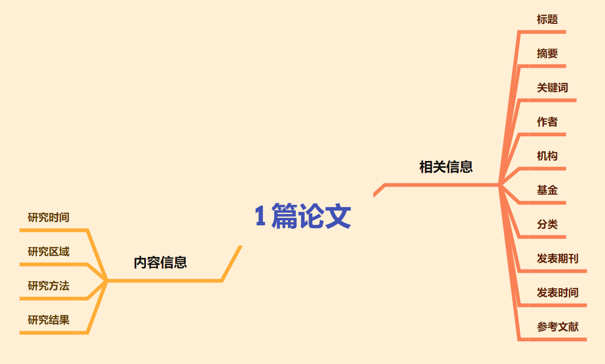

<center>图 3-1 论文信息结构</center>

&emsp;&emsp;具体地，本研究采用了以下方法：

&emsp;&emsp;对于论文标题、摘要、关键词等文本信息，使用分词、词性标注、命名实体识别等方法进行预处理，并使用TF-IDF等方法提取关键词作为实体。

&emsp;&emsp;对于作者、机构、基金、分类等非文本信息，使用字符串匹配等方法进行标准化处理，并直接作为实体。

&emsp;&emsp;对于参考文献信息，使用字符串匹配等方法进行去重处理，并作为实体。

&emsp;&emsp;对于实体之间的关系，根据论文信息数据中各个字段之间的逻辑关系，定义了以下几种关系类型：
- 论文-作者：表示论文由作者撰写。
- 论文-机构：表示论文由机构支持或发表。
- 论文-基金：表示论文由基金资助。
- 论文-分类：表示论文属于某个分类领域。
- 论文-参考文献：表示论文引用了某篇参考文献。
- 论文-关键词：表示论文包含了某个关键词。
- 关键词-关键词：表示两个关键词在同一篇论文中出现过。
- 作者-机构：表示作者隶属于某个机构。
- 作者-作者：表示两个作者在同一篇论文中合作过。
- 机构-机构：表示两个机构在同一篇论文中合作过。

### 3.3 构建知识图谱

&emsp;&emsp;再次，利用图论等方法对知识网络进行进一步分析，挖掘出目标领域的核心主题、核心作者、核心机构、核心期刊等信息，并将这些信息组织成为知识图谱。

### 3.4 泛用性推广

&emsp;&emsp;最后，根据一些预先定义好的评价指标，如覆盖度、准确度、一致性、可读性等，对构建的知识网络和知识图谱进行质量和效果的评估，并探讨其在其他领域的泛用性和可扩展性。


## 第四章 研究进展

&emsp;&emsp;本节展示研究已经实现或正在进行的研究成果，以及研究的局限性和不足，以及一些可能的解决方案或改进方向。

### 4.1  WOS 检索式

&emsp;&emsp;首先选择 WOS 核心合集，在这个合集中记载着作者关键词和 Keywords Plus 等论文的核心内容信息。在检索时不区分大小写，并且按照主题检索会检索到文献的标题、摘要、作者关键词和 Keywords Plus（WOS赋予文章的关键词）。因为我们想对 SIF 与农业相关的文献进行分析，所以检索式如下所示：

```
(TS=(Solar-Induced Chlorophyll Fluorescence) OR TS=(Solar Induced Chlorophyll Fluorescence)) AND (TS=(Agriculture) OR TS=(Yield) OR TS=(Crop))
```

&emsp;&emsp;检索式中结合了相关论文对于 SIF 全称有无 - 符号的两种写法，以及农业相关的三个核心词汇 Agriculture，Yield，Crop 以此来提高相关论文的检索精确程度，最终检索到 260 篇相关文献。

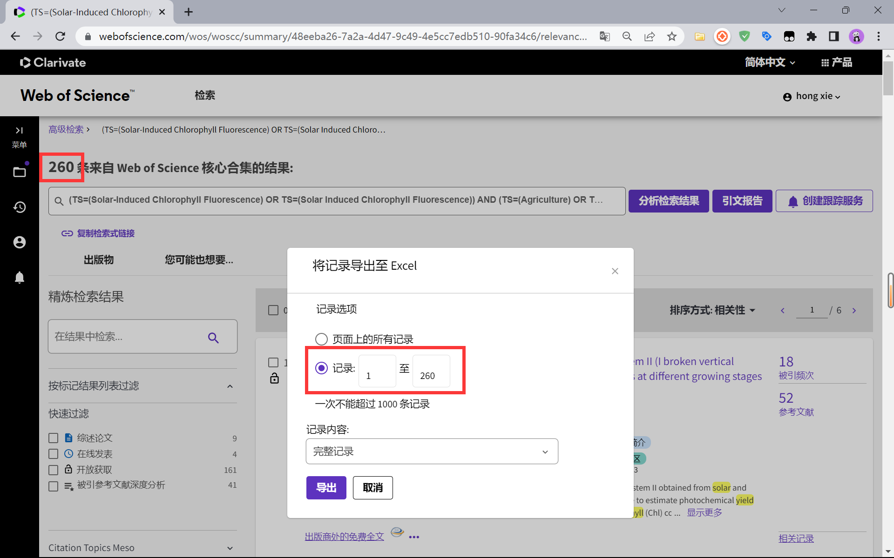

<center>图 4-1 WOS 检索 SIF 与农业结合相关文献</center>

### 4.2 数据清洗

&emsp;&emsp;对 WOS 导出的论文信息数据进行清洗，清洗无效数据列，仅保留 原文标题，期刊，作者关键词，WOS 关键词，摘要，作者地址，机构，引用次数，发表年份，DOI，研究领域等论文的相关核心数据。

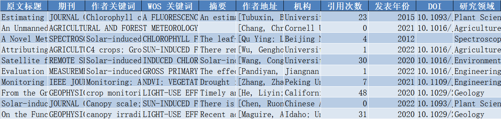

<center>图 4-2 清洗后的 WOS 论文检索结果</center>

### 4.3 同类词合并

#### 4.3.1 术语库制作

&emsp;&emsp;建立一个同义词和专业术语的映射表作为相关术语库，用于后续词频统计时的同类词合并，把不同的表达方式但是意思相同的单词或短语统一为一个标准的词汇，以便提高统计精度。

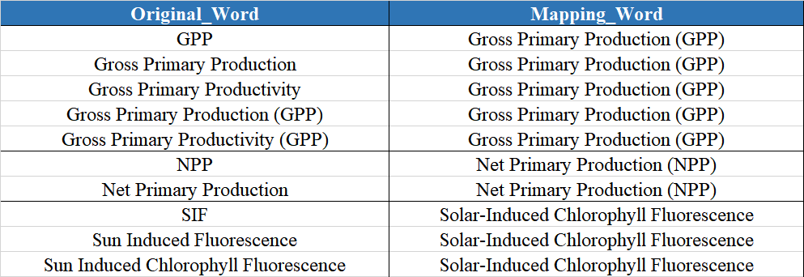

<center>图 4-3 自制同义词术语库</center>

#### 4.3.2 同类词合并

&emsp;&emsp;考虑到相关论文中对于大小写，空格符号等的不统一，在进行同类词合并前先将文本进行规范化预处理，如空格替换、首字母大写等。完成预处理后，再结合术语库对关键词进行同类词合并。

### 4.4 词频统计与词云图

#### 4.4.1 词频统计

&emsp;&emsp;对同类词合并后的关键词列表进行词频统计，统计了排名前100的关键词，排名前20的关键词词频结果如下图所示，可以看到除了 SIF 外，光合作用与总初级生产力（GPP）出现的频次最高。

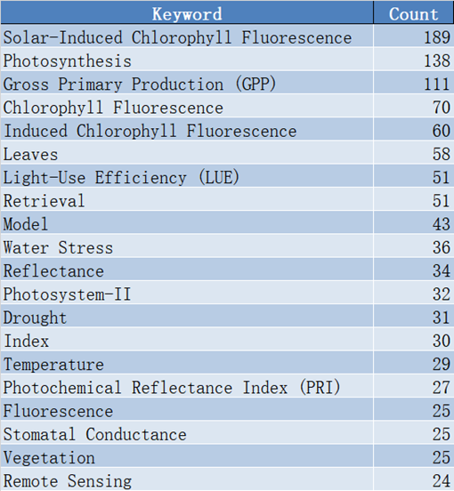

<center>图 4-4 词频统计</center>

#### 4.4.2 原文词云图

&emsp;&emsp;根据词频统计的结果绘制出的词云图如下，词频越高占据空间越大。将词频信息以可视化的词云形式呈现，能够更直观地看到各个关键词在该领域的重要性。

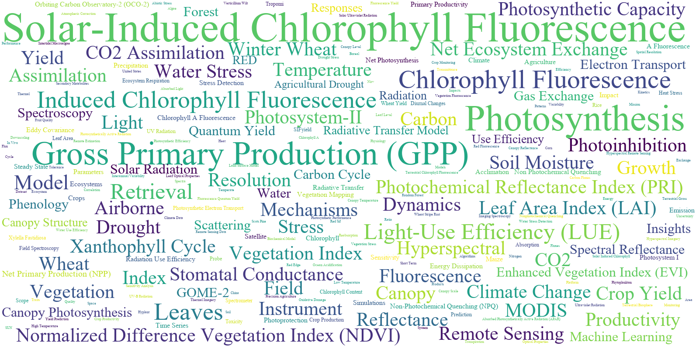

<center>图 4-5 SIF 相关论文关键词词云图</center>

### 4.5 机器翻译

&emsp;&emsp;为了便于其他人员查看，还接入各个平台的机器翻译API接口，用于批量翻译英文文献，从而实现对词云图的转译。

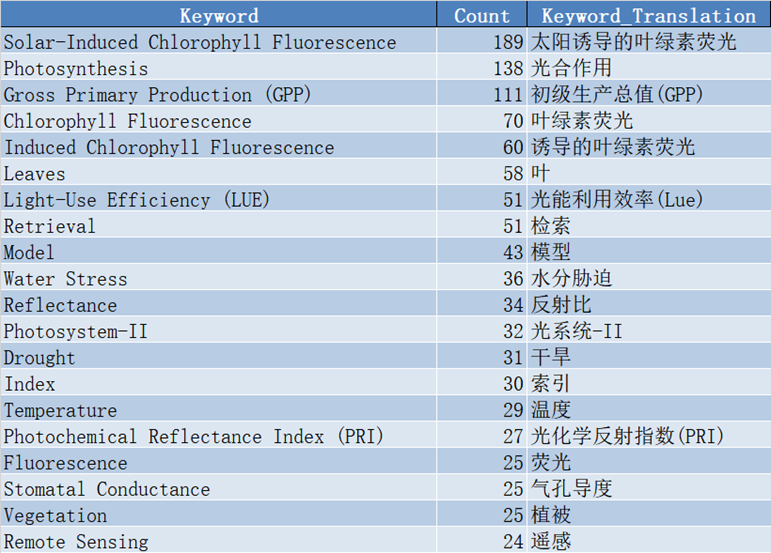

<center>图 4-6 SIF关键词词频统计（含翻译）</center>

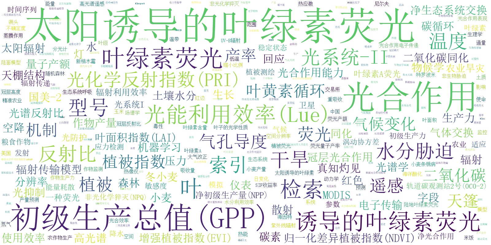

<center>图 4-7 SIF 相关论文关键词中文词云图</center>


## 第五章 前沿技术

&emsp;&emsp;本章介绍最新出现的几个结合GPT大模型的论文分析操作，探讨这些操作与本研究有什么联系和启发，以及这些操作有什么优缺点和挑战。

### 5.1 New Bing

&emsp;&emsp;在 OpenAI 的 ChatGPT 引发热潮之后，微软必应搜索又推出了一款聊天模式搜索引擎，名为 New Bing。它可以用中文和用户进行自然的对话，同时联网查找答案，并生成有创意的内容。我们可以把它简单地理解为一个联网版的 GPT。

&emsp;&emsp;我们可以通过准备好的问答模板，借助它强大的搜索能力和语言自分析能力，来实现对一篇论文的快速解析。但是，作为一个仍在高速发展的大语言模型，它还不能完整地理解一篇文献的内容，并且由于互联网内容的驳杂，导致其语料库受到不同程度的污染，有时无法客观真实地解读一篇文献的核心信息。

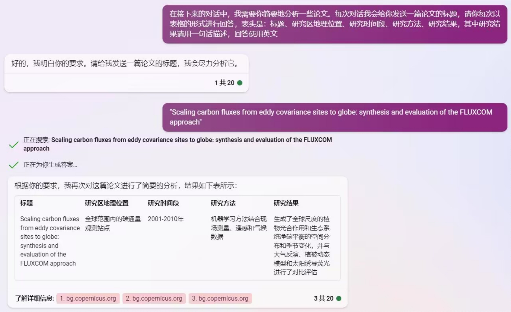

<center>图 5-1 New Bing 检索论文信息</center>

### 5.2 ChatGPT Academic

&emsp;&emsp;ChatGPT Academic 是一个基于 ChatGPT API 开发的科研工作专用ChatGPT拓展，特别优化学术Paper润色体验，支持自定义快捷按钮，支持markdown表格显示，Tex公式双显示，代码显示功能完善，新增本地Python工程剖析功能/自我剖析功能。

&emsp;&emsp;它目前集合了多种大模型以及不断添加的问答模板，能够更高效地为我们提供大模型带来的便捷服务。但是在使用上仍然受到诸多限制。一是作为核心模型的 ChatGPT 的使用，需要 OpenAI 提供的 GPT Keys 国内很难获取，二是本地部署的大模型对于 GPU 配置要求较高，并不具有广泛应用性。

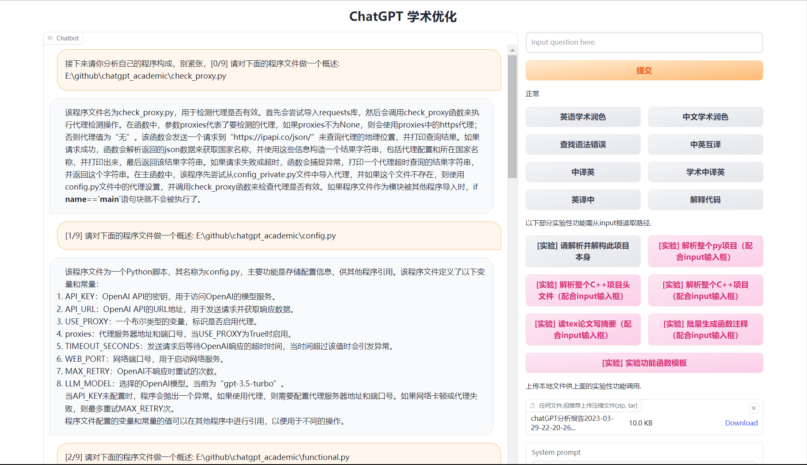

<center>图 5-2 ChatGPT Academic 解析示例</center>

### 5.3 ChatGPT + Zotero

&emsp;&emsp;zotero-gpt 是一个与 Zotero 集成的 GPT 插件，本质上是通过 OpenAI 提供的 GPT Keys 以及预设的问题模板，结合 Zotero 文献阅读器实现对论文的快速分析。但是普通用户也面临着与 5.2 节相同的问题。

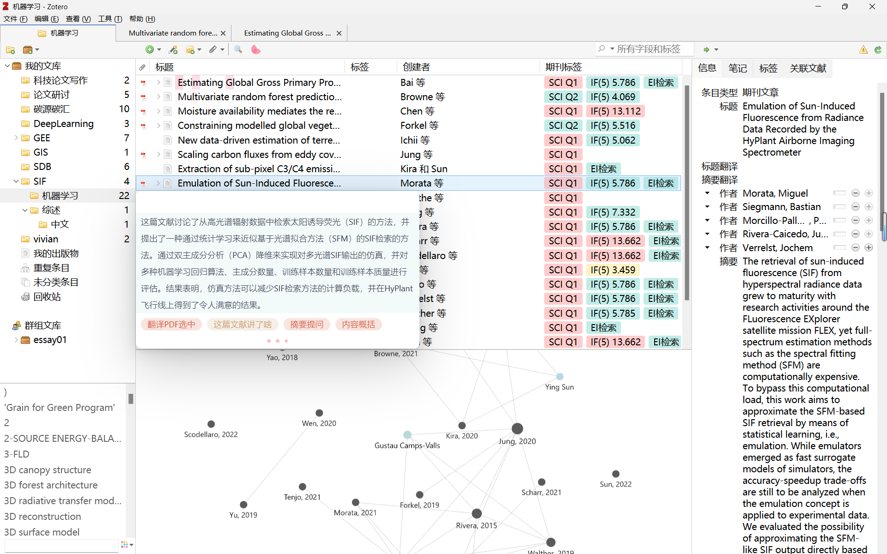

<center>图 5-3 ChatGPT Zotero 插件使用</center>

### 5.4 国内大模型

&emsp;&emsp;在 ChatGPT 掀起 AI 浪潮之后，国内的大模型也在加快开发进程，已经推出了一些产品，例如百度的文心一言、阿里巴巴的通义千问、科大讯飞的星火大模型等。虽然与 ChatGPT 乃至更先进的 GPT 4.0 相比还有一定差距，但是国产大模型也在不断提升自身能力，期待有一天能够赶上 OpenAI 的水准。


## 第六章 总结与展望

&emsp;&emsp;本文以 SIF 领域研究为例，探索了基于 WOS 论文信息数据构建目标研究领域知识网络和知识图谱的方法和实践。本章对全文进行总结，并对未来的研究方向进行展望。

### 6.1 总结

&emsp;&emsp;本文旨在探索利用 WOS 论文信息数据构建目标研究领域知识网络和知识图谱的可行性和有效性，为研究提供新的视角和工具。提出了基于 WOS 论文信息数据构建目标研究领域知识网络和知识图谱的框架和流程，包括数据预处理、抽取实体关系、构建知识图谱和泛用性推广四个步骤。

&emsp;&emsp;以 SIF 领域为案例，实现了基于 WOS 论文信息数据构建 SIF 领域知识网络和知识图谱的系统，包括 WOS 检索式、数据清洗、同类词合并、词频统计与词云图、机器翻译等功能模块。

&emsp;&emsp;利用知识图谱技术对 SIF 领域的研究现状、发展趋势、核心主题、重要作者、机构、期刊等进行了可视化分析，揭示了 SIF 领域的知识结构和演化规律。

&emsp;&emsp;探讨了基于 WOS 论文信息数据构建目标研究领域知识网络和知识图谱的泛用性和可扩展性，介绍了一些前沿技术，如 New Bing、ChatGPT Academic、ChatGPT + Zotero 和国内大模型等，为其他领域的研究提供了参考和借鉴。

### 6.2 展望

&emsp;&emsp;本文虽然在基于 WOS 论文信息数据构建目标研究领域知识网络和知识图谱方面取得了一定的成果，但仍然存在一些不足和局限，需要在未来的研究中进一步完善和改进。具体有三个方面：数据源的丰富性，实体关系的准确性，知识图谱的智能化。

&emsp;&emsp;本文只使用了 WOS 数据库作为数据源，而忽略了其他可能包含有价值信息的数据库，如 CNKI、Scopus、Google Scholar 等。未来可以考虑整合多源数据，提高数据的覆盖率和质量。

&emsp;&emsp;本文采用了基于规则的方法抽取实体关系，虽然简单易行，但也存在一定的误差和漏检。未来可以考虑引入基于机器学习或深度学习的方法，提高实体关系抽取的准确性和召回率。

&emsp;&emsp;本文构建的知识图谱主要用于可视化分析，而缺乏更深层次的智能应用，如问答、推荐等。


