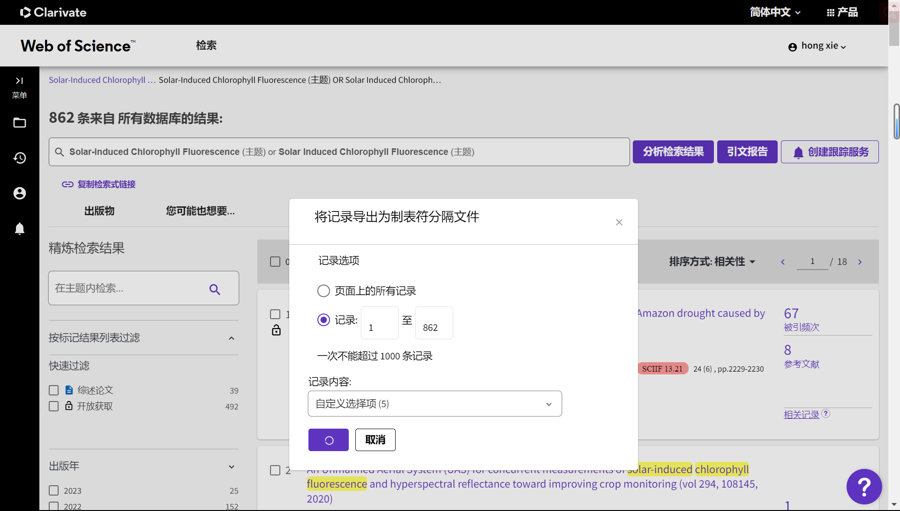
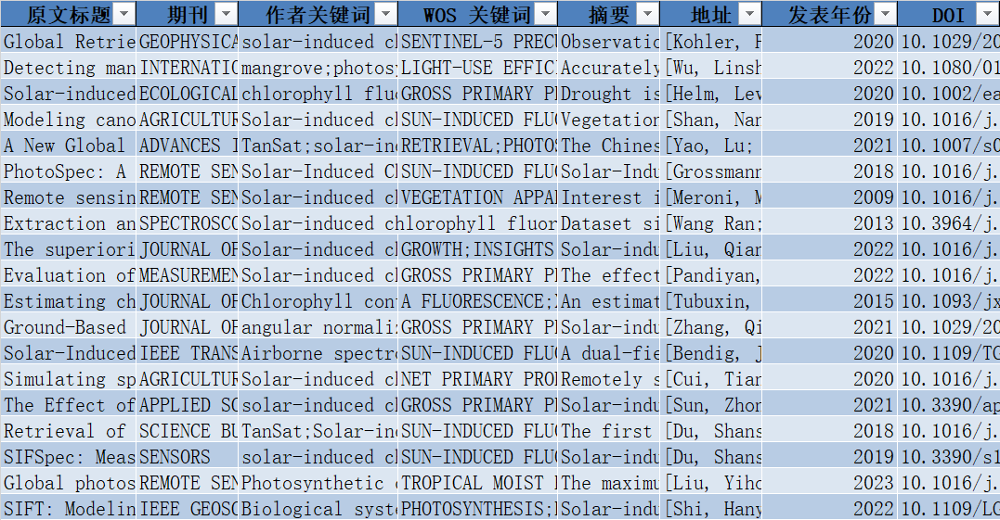
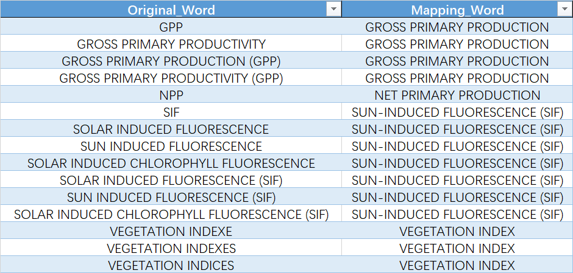
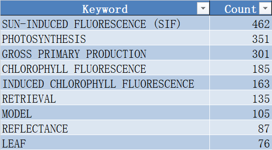
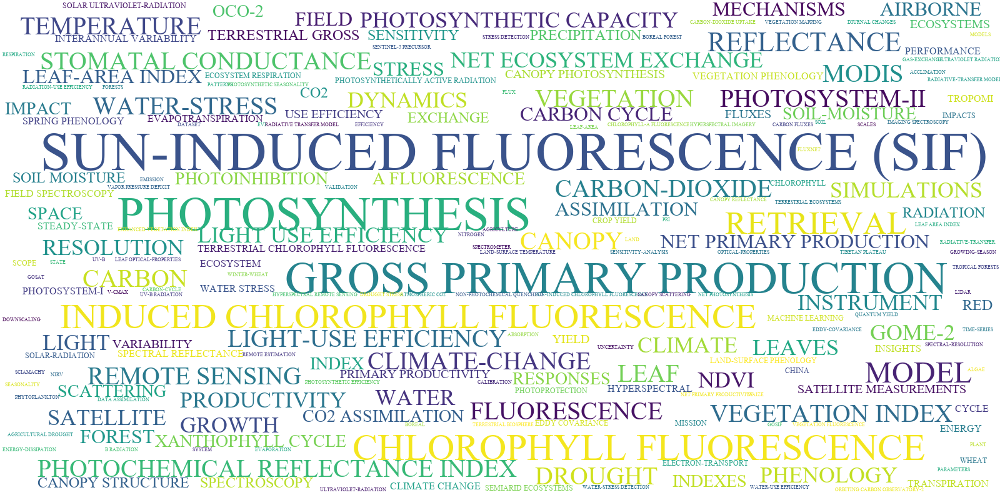
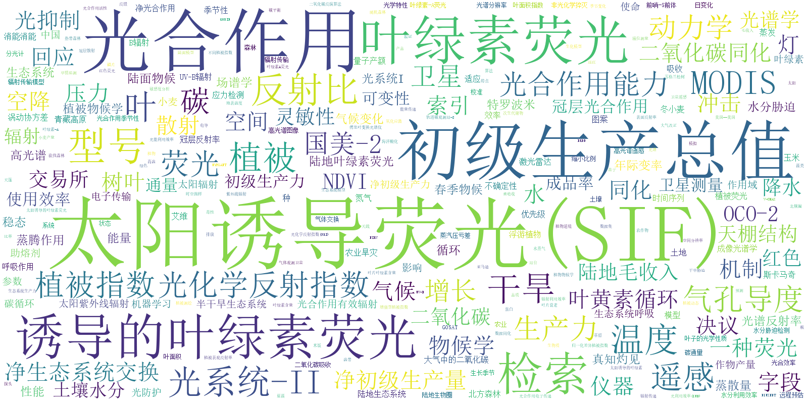

# 基于 WOS 论文信息数据构建目标研究领域知识网络和知识图谱：以 SIF 领域研究为例

## 一、研究介绍

本节介绍本研究动机和核心思路，以及涉及到的相关概念，如 WOS、SIF、论文分析工具、知识图谱等。

### 1 研究动机

- 首先，在进行 SIF 领域的研究时，需要阅读大量的相关论文摘要，但是由于时间和精力的限制，无法逐一阅读。因此，希望开发一个能够自动化提取论文元数据（如研究方向、研究方法、研究区域、研究应用、相关期刊、引领研究的国家等）的工具，以便快速了解论文的主要内容和特点。
- 其次，受到 Connected Papers 和 CiteSpace 等论文网络分析和可视化方法的启发，想要结合自身需求设计出一个能够对批量论文信息进行网络分析和可视化的工具，以便发现论文之间的联系和规律，以及目标领域的知识结构和发展趋势。
- 最后，想要将自己接触到的业务开发与科研工作相结合，将自身做学融汇贯通，形成属于自己的一个完整的系统。

### 2 核心思路

本研究利用 Python 工具对 Web of Science 检索到的某一目标领域（以 SIF 太阳诱导的叶绿素荧光遥感为例）的相关论文信息数据进行分析，构建该领域的知识网络和知识图谱，实现对该领域核心内容的快速理解和掌握，为科研工作提供支持。本研究涉及到自然语言处理、图论等相关领域的方法和技术，具有一定的创新性和实用性。

### 3 相关概念

#### 2.1 Web of Science (WOS)

Web of Science 是一个大型综合性、多学科、核心期刊引文索引数据库，包括科学引文索引、社会科学引文索引、艺术与人文科学引文索引等，可以用来检索论文、分析领域发展趋势、查询期刊影响因子等。

#### 2.2 SIF

Solar induced chlorophyll fluorescence(SIF) 是指植物叶片在光合作用过程中发出的一种微弱的荧光，可以反映植物的光合活性和生态系统的碳循环状态。

- 太阳、叶片、反射、荧光、光合作用、热量、透光

#### 2.3 论文分析工具

- Connected Papers：是一个在线工具，可以根据一篇论文找到相关的论文，并以图形的方式展示它们之间的联系，帮助用户探索某个领域的知识网络，发现研究热点和前沿。

- CiteSpace：是一个基于Java的可视化分析软件，可以对Web of Science等数据库中的文献数据进行引文网络分析，揭示出学科领域的知识结构和演化过程。

#### 2.4 知识图谱

知识图谱是一种表示和存储知识的结构化数据模型，由实体、属性和关系组成，可以用来描述复杂的概念和语义信息，支持智能检索和推理。

知识图谱（Knowledge Graph）是一种用结构化的形式描述客观世界中概念、实体及其之间关系的语义网络，可以将互联网的信息表达成更接近人类认知世界的形式，提供了一种更好地组织、管理和理解互联网海量信息的能力。知识图谱的基本组成单位是“实体—关系—实体”三元组，以及实体及其相关属性—值对，实体间通过关系相互联结，构成网状的知识结构。

知识图谱可以分为通用知识图谱和特定领域知识图谱，通用知识图谱面向的是通用领域，强调知识的广度，形态通常为结构化的百科知识；特定领域知识图谱则面向某一特定领域，强调知识的深度，通常需要基于该行业的数据库进行构建。

知识图谱涉及的技术主要包括知识抽取、知识表示、知识融合、知识推理等，这些技术可以帮助从不同来源的数据中获取、整合和利用知识，构建和完善知识图谱。

知识图谱有很多应用场景，比如搜索引擎、智能问答、推荐系统、数据分析等，它们都可以利用知识图谱提高信息检索、理解和交互的效率和质量。

## 二、研究目标

本节介绍本研究要解决的问题，以及本研究的创新点、贡献和预期结果。

### 1 主要解决问题

本研究主要解决以下三个问题：

- 如何有效地清洗 Web of Science 论文信息数据，保证数据的完整性和准确性？
- 如何利用自然语言处理和图论等方法从论文信息数据中提取知识元素和知识关系，构建知识图谱？
- 如何评价构建的知识图谱的质量和效果，以及如何实现其泛用性和可扩展性？

### 2 创新点和贡献

本研究有以下几个创新点和贡献：

- 本研究基于自然语言处理和图论等方法构建知识图谱，实现了对目标领域核心内容的可视化呈现和深入挖掘。
- 本研究设计了一套合理的评价指标和方法，对构建的知识图谱进行了质量和效果的评估，并探讨了其在其他领域的应用可能性。
- 本研究在SIF领域进行了实验验证，展示了本方法在该领域的有效性和优越性。

### 3 研究预期结果

本研究预期得到以下几个结果：

- 一个能够自动化分析 Web of Science 论文信息数据的 Python 工具。
- 一个能够反映 SIF 领域核心内容和知识结构的知识图谱。
- 一个能够评价知识图谱质量和效果的评价体系。
- 一个能够探讨知识图谱泛用性和可扩展性的研究报告。

## 三、研究方法

本节介绍本研究的方法和技术路线，以及本研究与其他相关工作的区别和优势。

### 1 数据预处理

- 首先，根据目标领域确定合适的检索策略，在 Web of Science 上检索相关论文信息并导出数据，使用 Python 工具进行清洗、存储等操作。

### 2 抽取实体关系

- 其次，利用自然语言处理等方法对论文信息数据进行分析，提取出论文标题、摘要、关键词、作者、机构、基金、分类、参考文献等实体，并根据一定的规则确定实体之间的关系，形成知识图谱。

- 具体地，本研究采用了以下方法：
  - 对于论文标题、摘要、关键词等文本信息，使用分词、词性标注、命名实体识别等方法进行预处理，并使用TF-IDF等方法提取关键词作为实体。
  - 对于作者、机构、基金、分类等非文本信息，使用字符串匹配等方法进行标准化处理，并直接作为实体。
  - 对于参考文献信息，使用字符串匹配等方法进行去重处理，并作为实体。
  - 对于实体之间的关系，根据论文信息数据中各个字段之间的逻辑关系，定义了以下几种关系类型：
    - 论文-作者：表示论文由作者撰写。
    - 论文-机构：表示论文由机构支持或发表。
    - 论文-基金：表示论文由基金资助。
    - 论文-分类：表示论文属于某个分类领域。
    - 论文-参考文献：表示论文引用了某篇参考文献。
    - 论文-关键词：表示论文包含了某个关键词。
    - 关键词-关键词：表示两个关键词在同一篇论文中出现过。
    - 作者-机构：表示作者隶属于某个机构。
    - 作者-作者：表示两个作者在同一篇论文中合作过。
    - 机构-机构：表示两个机构在同一篇论文中合作过。

### 3 构建知识图谱

- 再次，利用图论等方法对知识网络进行进一步分析，挖掘出目标领域的核心主题、核心作者、核心机构、核心期刊等信息，并将这些信息组织成为知识图谱。

### 4 泛用性推广

- 最后，根据一些预先定义好的评价指标，如覆盖度、准确度、一致性、可读性等，对构建的知识网络和知识图谱进行质量和效果的评估，并探讨其在其他领域的泛用性和可扩展性。

## 四、研究进展

本节展示研究的目前已经实现或正在进行的结果和成果，以及研究的局限性和不足，以及一些可能的解决方案或改进方向。

### 1 数据清洗

对 WOS 导出的论文信息数据进行清洗，清洗无效数据列

### 2 术语库制作

制作了相关术语库，用于后续词频统计时的同类词合并，以便提高统计精度

### 3 词频统计与词云图

实现了对论文关键词的词频统计以及词云图的绘制

- 词频统计

- 原文词云图

### 4 机器翻译

接入各个平台的机器翻译API接口，用于批量翻译英文文献。

## 五、最新动态

介绍最新出现的几个结合GPT大模型的论文分析操作，说明这些操作与你的研究有什么联系和启发，以及这些操作有什么优缺点和挑战，以及你对这些操作有什么看法或建议。

### 5.1 New Bing

### 5.2 ChatGPT Academic

### 5.3 ChatGPT + Zotero

## 六、总结与展望

回顾研究的核心内容和主要结论，并给出一些未来的展望或期待，感谢听众的关注和参与，并邀请他们提出一些问题或反馈。

